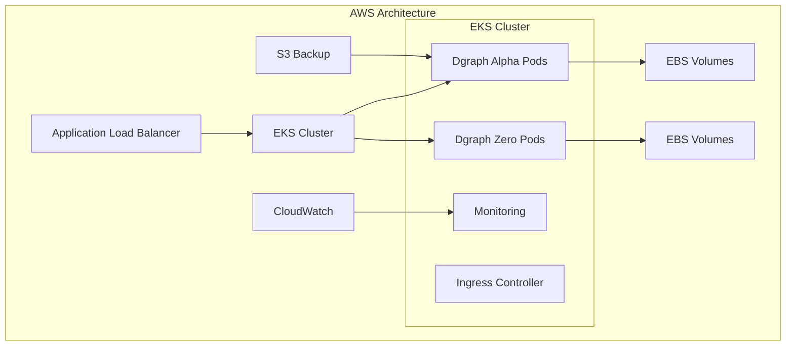
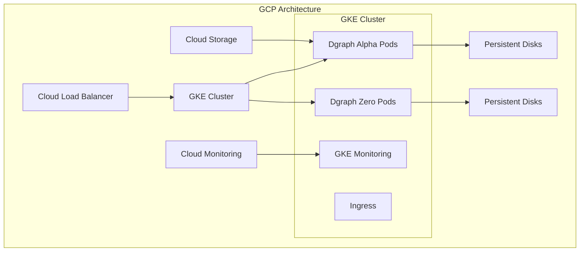
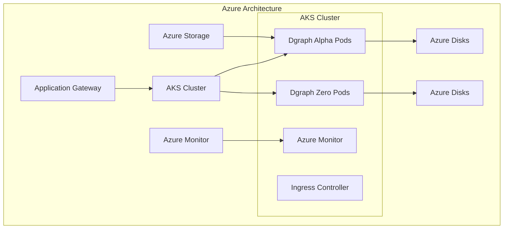
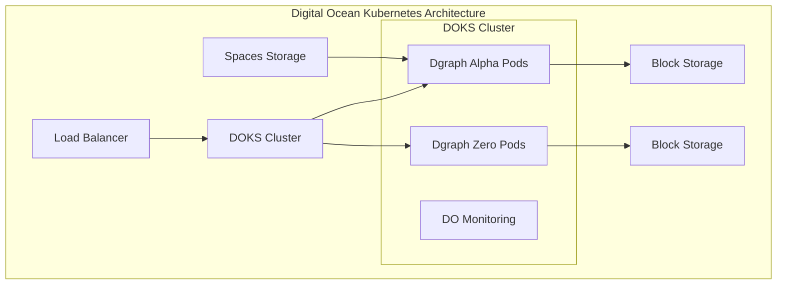
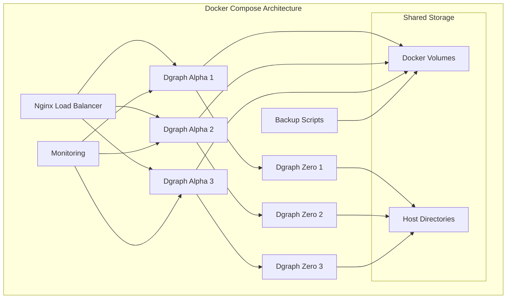
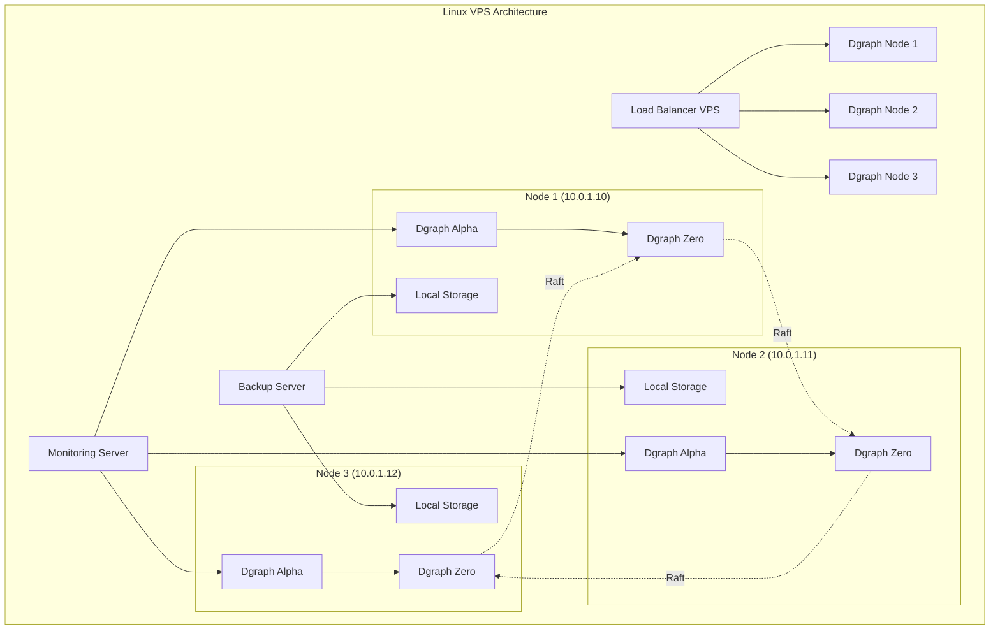
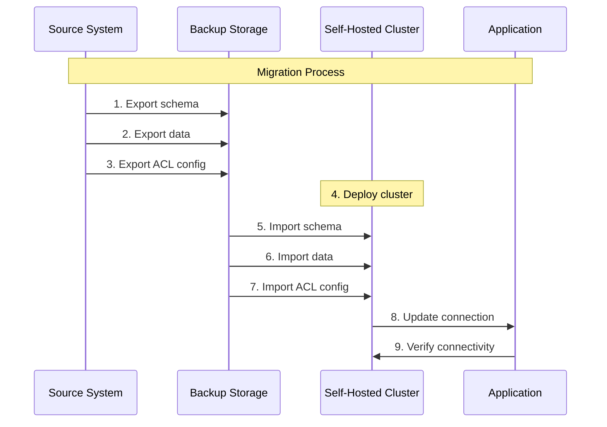
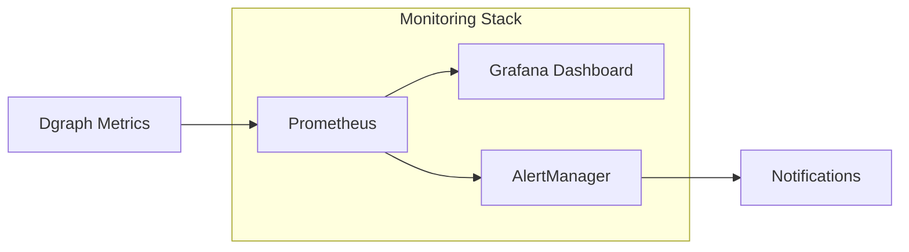

## Overview

This guide walks you through migrating your Dgraph database from
managed cloud services to a self-hosted
environment.  It covers step-by-step instructions for deployment using various cloud providers and methods, supporting goals like cost savings, increased control, and compliance.

### What You'll Learn

<CardGroup cols={2}>
  <Card title="Migration Planning" icon="clipboard-list">
    Assessment and planning strategies—including downtime minimization, resource calculations, and risk mitigation
  </Card>

<Card title="Data Export & Import" icon="database">
  Instructions for exporting data, backing up schema and ACLs, loading via bulk or live methods, and verifying data integrity
</Card>

<Card title="Infrastructure Deployment" icon="server">
  Deployment guidance for Kubernetes clusters, Docker Compose on Linux, and VPS configurations with load balancing and storage setup
</Card>

  <Card title="Operations & Monitoring" icon="chart-line">
    Monitoring and alerting, backup and disaster recovery, performance optimization, and security hardening practices.
  </Card>
</CardGroup>

### Deployment Options

When migrating to self-hosted Dgraph, your deployment choice depends on several
key factors: data size, team expertise, budget constraints, and control
requirements. Here's how these factors influence your deployment decision:

**Data Size Considerations:**

- **Under 100GB**: Docker Compose or Linux VPS are suitable options
- **100GB to 1TB**: Kubernetes or Linux VPS can handle the load
- **Over 1TB**: Kubernetes is required for proper scaling and management

**Team Expertise Factors:**

- **High Kubernetes Experience**: Kubernetes deployment is recommended
- **Limited Kubernetes Experience**: Docker Compose or Linux VPS are more
  approachable

**Budget Constraints:**

- **Cost Optimized**: Linux VPS provides the most economical option
- **Balanced**: Docker Compose offers a good middle ground
- **Enterprise**: Kubernetes provides enterprise-grade features

**Control Requirements:**

- **Maximum Control**: Linux VPS gives you full control over the environment
- **Managed Infrastructure**: Kubernetes provides managed infrastructure
  capabilities

**Available Deployment Methods:**

- **Kubernetes**: Best for large-scale deployments, enterprise environments, and
  teams with K8s expertise
- **Docker Compose**: Ideal for development, testing, and smaller production
  workloads
- **Linux VPS**: Perfect for cost-conscious deployments and teams wanting
  maximum control

---

## Prerequisites

Before starting your migration, ensure you have the necessary tools, access, and
resources.

### Required Tools

<CardGroup cols={2}>
  <Card title="Command Line Tools" icon="terminal">
    - `kubectl` (v1.24+)
    - `helm` (v3.8+)
    - `dgraph` CLI tool
    - `curl` or similar HTTP client
    - Cloud provider CLI tools
  </Card>

  <Card title="Development Tools" icon="code">
    - Docker (for local testing)
    - Git (for configuration management)
    - Text editor or IDE
    - SSH client
  </Card>
</CardGroup>

### Access Requirements

<Tabs>
  <Tab title="Source Systems">
    - **Dgraph Cloud**: Admin access to export data
    - **Hypermode Graph**: Database access credentials
    - **Network**: Ability to download large datasets
  </Tab>

  <Tab title="Target Infrastructure">
    - **Cloud Provider**: Account with appropriate permissions
    - **Kubernetes**: Cluster admin privileges (if using K8s)
    - **SSL/TLS**: Certificate management capability
    - **DNS**: Domain management for load balancers
  </Tab>
</Tabs>

### Minimum resource requirements

<Tabs>
  <Tab title="Small Cluster (< 100 GB)">
    - **Nodes**: 3 x 4 vCPU, 8 GB RAM
    - **Storage**: 200 GB solid-state drive per node
    - **Network**: 1 Gbps bandwidth
    - **Estimated Cost**: $150-300/month
  </Tab>

<Tab title="Medium Cluster (100 GB - 1 TB)">
  - **Nodes**: 6 x 8 vCPU, 16 GB RAM 
  - **Storage**: 500 GB solid-state drive per node 
  - **Network**: 1 Gbps bandwidth 
  - **Estimated Cost**: $500-800/month
</Tab>

  <Tab title="Large Cluster (> 1 TB)">
    - **Nodes**: 9+ x 16 vCPU, 32 GB RAM
    - **Storage**: 1 TB+ solid-state drive per node
    - **Network**: 10 Gbps bandwidth
    - **Estimated Cost**: $1500-3000/month
  </Tab>
</Tabs>

---

## Data export from source systems

The first step in migration is safely exporting your data from your current
managed service. This section covers export procedures for both Dgraph Cloud and
Hypermode Graphs.

### Exporting from Dgraph Cloud

Dgraph Cloud provides several methods for exporting your data, including admin
API endpoints and the web interface.

#### Method 1: Using the Web Interface

<Steps>
  <Step title="Access Export Function">
    Log into your Dgraph Cloud dashboard and navigate to your cluster.
    
    <Note>
      Screenshot placeholder: Show the main dashboard with cluster overview
    </Note>
  </Step>

<Step title="Navigate to Export">
  Click on the "Export" tab in your cluster management interface. 
  <Note>
    Screenshot placeholder: Highlight the export tab in the navigation
  </Note>
</Step>

<Step title="Configure Export Settings">
  Select your export format and destination. Dgraph Cloud supports: -
  **Format**: JSON or RDF - **Destination**: Download link or cloud storage -
  **Compression**: Optional gzip compression 
  <Note>Screenshot placeholder: Show export configuration options</Note>
</Step>

<Step title="Start Export Process">
  Click "Start Export" and monitor the progress. Large datasets may take several
  hours. 
  <Note>Screenshot placeholder: Show export progress indicator</Note>
</Step>

  <Step title="Download Exported Data">
    Once complete, download your exported data files.
    
    <Note>
      Screenshot placeholder: Show download links for completed export
    </Note>
  </Step>
</Steps>

#### Method 2: Using Admin API

<CodeGroup>
```bash Check Cluster Status
curl -X POST https://your-cluster.grpc.cloud.dgraph.io/admin \
  -H "Content-Type: application/json" \
  -d '{"query": "{ state { groups { id members { id addr leader lastUpdate } } } }"}'
```

```bash Export Schema
curl -X POST https://your-cluster.grpc.cloud.dgraph.io/admin \
  -H "Content-Type: application/json" \
  -d '{"query": "schema {}"}' > schema_backup.json
```

```bash Export Data (Small Datasets)
curl -X POST https://your-cluster.grpc.cloud.dgraph.io/admin \
  -H "Content-Type: application/json" \
  -d '{"query": "{ backup(destination: \"s3://your-bucket/backup\") { response { message code } } }"}'
```

```bash Export Data (Alternative Method)
dgraph export --alpha=your-cluster.grpc.cloud.dgraph.io:443 \
  --output=/path/to/export \
  --format=json
```

</CodeGroup>

#### Method 3: Bulk Export for Large Datasets

For datasets larger than 10GB, use the bulk export feature:

<CodeGroup>
```bash Request Bulk Export
curl -X POST https://your-cluster.grpc.cloud.dgraph.io/admin \
  -H "Content-Type: application/json" \
  -d '{
    "query": "mutation { 
      export(input: {
        destination: \"s3://your-backup-bucket/$(date +%Y-%m-%d)\",
        format: \"rdf\",
        namespace: 0
      }) { 
        response { 
          message 
          code 
        } 
      } 
    }"
  }'
```

```bash Check Export Status
curl -X POST https://your-cluster.grpc.cloud.dgraph.io/admin \
  -H "Content-Type: application/json" \
  -d '{"query": "{ state { ongoing } }"}'
```

</CodeGroup>

### Exporting from Hypermode Graphs

Hypermode Graphs provides native export capabilities through both API and
interface methods.

#### Using `admin` endpoint

```bash
curl --location 'https://<YOUR_CLUSTER_NAME>.hypermode.host/dgraph/admin' \
--header 'Content-Type: application/json' \
--header 'Dg-Auth: ••••••' \
--data '{"query":"mutation {\n  export(input: { format: \"rdf\" }) {\n    response {\n      message\n      code\n    }\n  }\n}","variables":{}}'
```

### Export Validation and Preparation

<Warning>
  Always validate your exported data before proceeding with the migration.
</Warning>

#### Data Integrity Checks

<CodeGroup>

```bash Verify Export Completeness
# Check file sizes and contents
ls -lah exported_data/
file exported_data/*

# For RDF exports, count triples

if [[-f "exported_data/g01.rdf.gz"]]; then zcat exported_data/g01.rdf.gz | wc -l
fi

# For JSON exports, validate structure

if [[-f "exported_data/g01.json.gz"]]; then zcat exported_data/g01.json.gz | jq
'.[] | keys' | head -10 fi

```

```bash Schema Validation
# Validate schema syntax
if [[ -f "schema.graphql" ]]; then
  # Basic GraphQL syntax check
  node -e "
    const fs = require('fs');
    const schema = fs.readFileSync('schema.graphql', 'utf8');
    console.log('Schema length:', schema.length);
    console.log('Types defined:', (schema.match(/type \w+/g) || []).length);
  "
fi

# Check for required predicates
grep -E "(uid|dgraph\.|type)" schema_backup.json || echo "Warning: System predicates missing"
```

```bash Calculate Dataset Metrics
# Estimate import time and resources needed
echo "=== Dataset Analysis ==="
echo "Total files: $(find exported_data/ -name "*.gz" | wc -l)"
echo "Total size: $(du -sh exported_data/ | cut -f1)"
echo "Largest file: $(find exported_data/ -name "*.gz" -exec ls -lah {} \; | sort -k5 -hr | head -1)"

# Estimate nodes and edges
if [[ -f "exported_data/g01.rdf.gz" ]]; then
  echo "Estimated triples: $(zcat exported_data/g01.rdf.gz | wc -l)"
fi
```

</CodeGroup>

#### Prepare for Transfer

<Steps>
  <Step title="Organize Export Files">
    ```bash
    # Create organized directory structure
    mkdir -p migration_data/{data,schema,acl,scripts}
    
    # Move files to appropriate directories
    mv exported_data/*.rdf.gz migration_data/data/
    mv schema* migration_data/schema/
    mv acl* migration_data/acl/
    ```
  </Step>

<Step title="Create Checksums">
  ```bash # Generate checksums for integrity verification cd migration_data find
  . -type f -name "*.gz" -exec sha256sum {} \; > checksums.txt find . -type f
  -name "*.json" -exec sha256sum {} \; >> checksums.txt ```
</Step>

  <Step title="Compress for Transfer">
    ```bash
    # Create final migration package
    cd ..
    tar -czf migration_package_$(date +%Y%m%d).tar.gz migration_data/
    
    # Verify package
    tar -tzf migration_package_*.tar.gz | head -10
    ```
  </Step>
</Steps>

---

## Pre-Migration Planning

Proper planning is crucial for a successful migration. This section helps you
assess your current environment and plan the migration strategy.

### 1. Assess Current Environment

<CodeGroup>
```bash Analyze Current Usage
# For Dgraph Cloud
curl -X POST https://your-cluster.grpc.cloud.dgraph.io/admin \
  -H "Content-Type: application/json" \
  -d '{"query": "{ state { groups { id checksum tablets { predicate space } } } }"}'

# For Hypermode Graph

hypermode graph stats --detailed

````

```bash Check Performance Metrics
# Query response times
time curl -X POST https://your-cluster.grpc.cloud.dgraph.io/query \
  -H "Content-Type: application/json" \
  -d '{"query": "{ nodeCount(func: has(_predicate_)) { count(uid) } }"}'

# Memory and storage usage
curl -X POST https://your-cluster.grpc.cloud.dgraph.io/admin \
  -H "Content-Type: application/json" \
  -d '{"query": "{ state { groups { id members { groupId addr } } } }"}'
````

</CodeGroup>

### 2. Infrastructure Sizing

<CardGroup cols={2}>
  <Card title="CPU Requirements" icon="microchip">
    **Alpha Nodes**: 2-4 cores per 1M edges
    **Zero Nodes**: 1-2 cores (coordination only)
    **Load Balancer**: 2-4 cores
    **Monitoring**: 1-2 cores
  </Card>

  <Card title="Memory Requirements" icon="memory">
    **Alpha Nodes**: 4-8 GB base + 1 GB per 10M edges
    **Zero Nodes**: 2-4 GB (metadata storage)
    **Load Balancer**: 2-4 GB
    **Monitoring**: 4-8 GB
  </Card>
</CardGroup>

<CardGroup cols={2}>
  <Card title="Storage Requirements" icon="hard-drive">
    **Data Volume**: 3-5x compressed export size **WAL Logs**: 20-50 GB per node
    **Backup Space**: 2x data volume **Monitoring**: 50-100 GB
  </Card>

  <Card title="Network Requirements" icon="network-wired">
    **Internal**: 1 Gbps minimum between nodes **External**: 100 Mbps minimum
    for clients **Bandwidth**: Plan for 3x normal traffic during migration
    **Latency**: &lt;10 ms between data nodes
  </Card>
</CardGroup>

---

## AWS Deployment

Deploy your self-hosted Dgraph cluster on Amazon Web Services using Elastic
Kubernetes Service (EKS).



### 1. Infrastructure Setup

#### EKS Cluster Creation

<CodeGroup>
```bash Create EKS Cluster
aws eks create-cluster \
  --name dgraph-cluster \
  --version 1.28 \
  --role-arn arn:aws:iam::ACCOUNT:role/eks-service-role \
  --resources-vpc-config subnetIds=subnet-12345,securityGroupIds=sg-12345
```

```bash Update Kubeconfig
aws eks update-kubeconfig --region us-west-2 --name dgraph-cluster
```

```bash Create Node Group
aws eks create-nodegroup \
  --cluster-name dgraph-cluster \
  --nodegroup-name dgraph-nodes \
  --instance-types t3.xlarge \
  --ami-type AL2_x86_64 \
  --capacity-type ON_DEMAND \
  --scaling-config minSize=3,maxSize=9,desiredSize=6 \
  --disk-size 100 \
  --node-role arn:aws:iam::ACCOUNT:role/NodeInstanceRole
```

</CodeGroup>

#### Storage Class Configuration

```yaml aws-storage-class.yaml
apiVersion: storage.k8s.io/v1
kind: StorageClass
metadata:
  name: dgraph-storage
provisioner: ebs.csi.aws.com
parameters:
  type: gp3
  iops: "3000"
  throughput: "125"
volumeBindingMode: WaitForFirstConsumer
allowVolumeExpansion: true
```

### 2. Dgraph Deployment on AWS

<Steps>
  <Step title="Apply Storage Class">
    ```bash kubectl apply -f aws-storage-class.yaml ```
  </Step>

<Step title="Add Helm Repository">
  ```bash helm repo add dgraph https://charts.dgraph.io helm repo update ```
</Step>

<Step title="Create Namespace">
  ```bash kubectl create namespace dgraph ```
</Step>

  <Step title="Deploy Dgraph">
    ```bash
    helm install dgraph dgraph/dgraph \
      --namespace dgraph \
      --set image.tag="v23.1.0" \
      --set alpha.persistence.storageClass="dgraph-storage" \
      --set alpha.persistence.size="500Gi" \
      --set zero.persistence.storageClass="dgraph-storage" \
      --set zero.persistence.size="100Gi" \
      --set alpha.replicaCount=3 \
      --set zero.replicaCount=3 \
      --set alpha.resources.requests.memory="8Gi" \
      --set alpha.resources.requests.cpu="2000m"
    ```
  </Step>
</Steps>

### 3. Load Balancer Configuration

```yaml aws-ingress.yaml
apiVersion: networking.k8s.io/v1
kind: Ingress
metadata:
  name: dgraph-ingress
  namespace: dgraph
  annotations:
    kubernetes.io/ingress.class: alb
    alb.ingress.kubernetes.io/scheme: internet-facing
    alb.ingress.kubernetes.io/target-type: ip
    alb.ingress.kubernetes.io/certificate-arn: arn:aws:acm:REGION:ACCOUNT:certificate/CERT-ID
spec:
  rules:
    - host: dgraph.yourdomain.com
      http:
        paths:
          - path: /
            pathType: Prefix
            backend:
              service:
                name: dgraph-dgraph-alpha
                port:
                  number: 8080
```

---

## Google Cloud Platform Deployment

Deploy your self-hosted Dgraph cluster on Google Cloud Platform using Google
Kubernetes Engine (GKE).



### 1. GKE Cluster Setup

<CodeGroup>
```bash Create GKE Cluster
gcloud container clusters create dgraph-cluster \
  --zone=us-central1-a \
  --machine-type=e2-standard-4 \
  --num-nodes=3 \
  --disk-size=100GB \
  --disk-type=pd-ssd \
  --enable-autoscaling \
  --min-nodes=3 \
  --max-nodes=9 \
  --enable-autorepair \
  --enable-autoupgrade
```

```bash Get Credentials
gcloud container clusters get-credentials dgraph-cluster --zone=us-central1-a
```

```bash Create Storage Class
kubectl apply -f - <<EOF
apiVersion: storage.k8s.io/v1
kind: StorageClass
metadata:
  name: dgraph-storage
provisioner: kubernetes.io/gce-pd
parameters:
  type: pd-ssd
  zones: us-central1-a,us-central1-b,us-central1-c
volumeBindingMode: WaitForFirstConsumer
allowVolumeExpansion: true
EOF
```

</CodeGroup>

### 2. Deploy Dgraph on GKE

```bash
# Create namespace
kubectl create namespace dgraph

# Deploy with Helm
helm install dgraph dgraph/dgraph \
  --namespace dgraph \
  --set alpha.persistence.storageClass="dgraph-storage" \
  --set zero.persistence.storageClass="dgraph-storage" \
  --set alpha.persistence.size="500Gi" \
  --set zero.persistence.size="100Gi" \
  --set alpha.replicaCount=3 \
  --set zero.replicaCount=3
```

### 3. Load Balancer Setup

```yaml gcp-ingress.yaml
apiVersion: networking.k8s.io/v1
kind: Ingress
metadata:
  name: dgraph-ingress
  namespace: dgraph
  annotations:
    kubernetes.io/ingress.global-static-ip-name: dgraph-ip
    networking.gke.io/managed-certificates: dgraph-ssl-cert
spec:
  rules:
    - host: dgraph.yourdomain.com
      http:
        paths:
          - path: /*
            pathType: ImplementationSpecific
            backend:
              service:
                name: dgraph-dgraph-alpha
                port:
                  number: 8080
```

---

## Azure Deployment

Deploy your self-hosted Dgraph cluster on Microsoft Azure using Azure Kubernetes
Service (AKS).



### 1. AKS Cluster Creation

<CodeGroup>
```bash Create Resource Group
az group create --name dgraph-rg --location eastus
```

```bash Create AKS Cluster
az aks create \
  --resource-group dgraph-rg \
  --name dgraph-cluster \
  --node-count 3 \
  --node-vm-size Standard_D4s_v3 \
  --node-osdisk-size 100 \
  --enable-addons monitoring \
  --generate-ssh-keys
```

```bash Get Credentials
az aks get-credentials --resource-group dgraph-rg --name dgraph-cluster
```

```bash Create Storage Class
kubectl apply -f - <<EOF
apiVersion: storage.k8s.io/v1
kind: StorageClass
metadata:
  name: dgraph-storage
provisioner: kubernetes.io/azure-disk
parameters:
  storageaccounttype: Premium_LRS
  kind: Managed
volumeBindingMode: WaitForFirstConsumer
allowVolumeExpansion: true
EOF
```

</CodeGroup>

### 2. Deploy Dgraph on AKS

```bash
# Create namespace
kubectl create namespace dgraph

# Deploy with Helm
helm install dgraph dgraph/dgraph \
  --namespace dgraph \
  --set alpha.persistence.storageClass="dgraph-storage" \
  --set zero.persistence.storageClass="dgraph-storage" \
  --set alpha.persistence.size="500Gi" \
  --set zero.persistence.size="100Gi"
```

---

## Digital Ocean Deployment

### Kubernetes Deployment (DOKS)



#### 1. DOKS Cluster Setup

<CodeGroup>
```bash Create Cluster
doctl kubernetes cluster create dgraph-cluster \
  --region nyc1 \
  --version 1.28.2-do.0 \
  --node-pool="name=worker-pool;size=s-4vcpu-8gb;count=3;auto-scale=true;min-nodes=3;max-nodes=9"
```

```bash Get Kubeconfig
doctl kubernetes cluster kubeconfig save dgraph-cluster
```

```bash Apply Storage Class
kubectl apply -f - <<EOF
apiVersion: storage.k8s.io/v1
kind: StorageClass
metadata:
  name: dgraph-storage
provisioner: dobs.csi.digitalocean.com
allowVolumeExpansion: true
volumeBindingMode: WaitForFirstConsumer
EOF
```

</CodeGroup>

#### 2. Deploy Dgraph on DOKS

```bash
# Create namespace
kubectl create namespace dgraph

# Deploy with Helm
helm install dgraph dgraph/dgraph \
  --namespace dgraph \
  --set alpha.persistence.storageClass="dgraph-storage" \
  --set zero.persistence.storageClass="dgraph-storage" \
  --set alpha.persistence.size="500Gi" \
  --set zero.persistence.size="100Gi"
```

### Docker Compose Deployment



#### 1. Prepare Docker Compose Environment

<Steps>
  <Step title="Create Directory Structure">
    ```bash
    mkdir -p dgraph-compose/{data,config,backups,nginx}
    cd dgraph-compose
    ```
  </Step>
  
  <Step title="Create Docker Compose File">
    ```yaml docker-compose.yml
    version: '3.8'
    
    services:
      # Dgraph Zero nodes
      dgraph-zero-1:
        image: dgraph/dgraph:v23.1.0
        container_name: dgraph-zero-1
        ports:
          - "5080:5080"
          - "6080:6080"
        volumes:
          - ./data/zero1:/dgraph
        command: dgraph zero --my=dgraph-zero-1:5080 --replicas=3 --idx=1
        restart: unless-stopped
        networks:
          - dgraph-network
    
      dgraph-zero-2:
        image: dgraph/dgraph:v23.1.0
        container_name: dgraph-zero-2
        ports:
          - "5081:5080"
          - "6081:6080"
        volumes:
          - ./data/zero2:/dgraph
        command: dgraph zero --my=dgraph-zero-2:5080 --replicas=3 --peer=dgraph-zero-1:5080 --idx=2
        restart: unless-stopped
        networks:
          - dgraph-network
        depends_on:
          - dgraph-zero-1
    
      dgraph-zero-3:
        image: dgraph/dgraph:v23.1.0
        container_name: dgraph-zero-3
        ports:
          - "5082:5080"
          - "6082:6080"
        volumes:
          - ./data/zero3:/dgraph
        command: dgraph zero --my=dgraph-zero-3:5080 --replicas=3 --peer=dgraph-zero-1:5080 --idx=3
        restart: unless-stopped
        networks:
          - dgraph-network
        depends_on:
          - dgraph-zero-1
    
      # Dgraph Alpha nodes
      dgraph-alpha-1:
        image: dgraph/dgraph:v23.1.0
        container_name: dgraph-alpha-1
        ports:
          - "8080:8080"
          - "9080:9080"
        volumes:
          - ./data/alpha1:/dgraph
        command: dgraph alpha --my=dgraph-alpha-1:7080 --zero=dgraph-zero-1:5080,dgraph-zero-2:5080,dgraph-zero-3:5080 --security whitelist=0.0.0.0/0
        restart: unless-stopped
        networks:
          - dgraph-network
        depends_on:
          - dgraph-zero-1
          - dgraph-zero-2
          - dgraph-zero-3
    
      dgraph-alpha-2:
        image: dgraph/dgraph:v23.1.0
        container_name: dgraph-alpha-2
        ports:
          - "8081:8080"
          - "9081:9080"
        volumes:
          - ./data/alpha2:/dgraph
        command: dgraph alpha --my=dgraph-alpha-2:7080 --zero=dgraph-zero-1:5080,dgraph-zero-2:5080,dgraph-zero-3:5080 --security whitelist=0.0.0.0/0
        restart: unless-stopped
        networks:
          - dgraph-network
        depends_on:
          - dgraph-zero-1
          - dgraph-zero-2
          - dgraph-zero-3
    
      dgraph-alpha-3:
        image: dgraph/dgraph:v23.1.0
        container_name: dgraph-alpha-3
        ports:
          - "8082:8080"
          - "9082:9080"
        volumes:
          - ./data/alpha3:/dgraph
        command: dgraph alpha --my=dgraph-alpha-3:7080 --zero=dgraph-zero-1:5080,dgraph-zero-2:5080,dgraph-zero-3:5080 --security whitelist=0.0.0.0/0
        restart: unless-stopped
        networks:
          - dgraph-network
        depends_on:
          - dgraph-zero-1
          - dgraph-zero-2
          - dgraph-zero-3
    
      # Load Balancer
      nginx:
        image: nginx:alpine
        container_name: dgraph-nginx
        ports:
          - "80:80"
          - "443:443"
        volumes:
          - ./nginx/nginx.conf:/etc/nginx/nginx.conf
          - ./nginx/ssl:/etc/nginx/ssl
        restart: unless-stopped
        networks:
          - dgraph-network
        depends_on:
          - dgraph-alpha-1
          - dgraph-alpha-2
          - dgraph-alpha-3
    
      # Monitoring
      prometheus:
        image: prom/prometheus:latest
        container_name: dgraph-prometheus
        ports:
          - "9090:9090"
        volumes:
          - ./config/prometheus.yml:/etc/prometheus/prometheus.yml
        restart: unless-stopped
        networks:
          - dgraph-network
    
      grafana:
        image: grafana/grafana:latest
        container_name: dgraph-grafana
        ports:
          - "3000:3000"
        volumes:
          - ./data/grafana:/var/lib/grafana
        environment:
          - GF_SECURITY_ADMIN_PASSWORD=admin
        restart: unless-stopped
        networks:
          - dgraph-network
    
    networks:
      dgraph-network:
        driver: bridge
    
    volumes:
      dgraph-data:
    ```
  </Step>
  
  <Step title="Create Nginx Configuration">
    ```nginx nginx/nginx.conf
    events {
        worker_connections 1024;
    }
    
    http {
        upstream dgraph_alpha {
            least_conn;
            server dgraph-alpha-1:8080;
            server dgraph-alpha-2:8080;
            server dgraph-alpha-3:8080;
        }
        
        upstream dgraph_grpc {
            least_conn;
            server dgraph-alpha-1:9080;
            server dgraph-alpha-2:9080;
            server dgraph-alpha-3:9080;
        }
    
        server {
            listen 80;
            server_name localhost;
    
            location / {
                proxy_pass http://dgraph_alpha;
                proxy_set_header Host $host;
                proxy_set_header X-Real-IP $remote_addr;
                proxy_set_header X-Forwarded-For $proxy_add_x_forwarded_for;
            }
        }
        
        # HTTPS configuration (uncomment and configure as needed)
        # server {
        #     listen 443 ssl http2;
        #     server_name your-domain.com;
        #     
        #     ssl_certificate /etc/nginx/ssl/cert.pem;
        #     ssl_certificate_key /etc/nginx/ssl/key.pem;
        #     
        #     location / {
        #         proxy_pass http://dgraph_alpha;
        #         proxy_set_header Host $host;
        #         proxy_set_header X-Real-IP $remote_addr;
        #         proxy_set_header X-Forwarded-For $proxy_add_x_forwarded_for;
        #         proxy_set_header X-Forwarded-Proto $scheme;
        #     }
        # }
    }
    ```
  </Step>
  
  <Step title="Create Prometheus Configuration">
    ```yaml config/prometheus.yml
    global:
      scrape_interval: 15s
    
    scrape_configs:
      - job_name: 'dgraph-alpha'
        static_configs:
          - targets: 
            - 'dgraph-alpha-1:8080'
            - 'dgraph-alpha-2:8080'
            - 'dgraph-alpha-3:8080'
        metrics_path: '/debug/prometheus_metrics'
        
      - job_name: 'dgraph-zero'
        static_configs:
          - targets: 
            - 'dgraph-zero-1:6080'
            - 'dgraph-zero-2:6080'
            - 'dgraph-zero-3:6080'
        metrics_path: '/debug/prometheus_metrics'
    ```
  </Step>
</Steps>

#### 2. Deploy and Manage Docker Compose Cluster

<CodeGroup>
```bash Start Cluster
# Start the entire cluster
docker-compose up -d

# Check status

docker-compose ps

# View logs

docker-compose logs -f dgraph-alpha-1

````

```bash Scale Cluster
# Add more alpha replicas
docker-compose up -d --scale dgraph-alpha=5

# Remove specific services
docker-compose stop dgraph-alpha-3
docker-compose rm dgraph-alpha-3
````

```bash Backup and Restore
# Create backup script
cat > backup.sh << 'EOF'
#!/bin/bash
DATE=$(date +%Y%m%d_%H%M%S)
BACKUP_DIR="./backups/$DATE"
mkdir -p $BACKUP_DIR

# Export data
docker exec dgraph-alpha-1 dgraph export --alpha localhost:9080 --destination /dgraph/export

# Copy to backup directory
docker cp dgraph-alpha-1:/dgraph/export $BACKUP_DIR/
echo "Backup completed: $BACKUP_DIR"
EOF

chmod +x backup.sh
./backup.sh
```

</CodeGroup>

### Linux VPS Deployment



#### 1. VPS Infrastructure Setup

<Steps>
  <Step title="Provision VPS Instances">
    Create 3-5 VPS instances with the following specifications: - **CPU**: 4-8
    cores - **RAM**: 16-32GB - **Storage**: 500GB+ SSD - **OS**: Ubuntu 22.04
    LTS - **Network**: Private networking enabled
  </Step>

<Step title="Configure Base System">
  ```bash # Update system (run on all nodes) sudo apt update && sudo apt upgrade
  -y # Install required packages sudo apt install -y curl wget unzip htop iotop
  # Configure firewall sudo ufw allow ssh sudo ufw allow 8080 # Dgraph Alpha
  HTTP sudo ufw allow 9080 # Dgraph Alpha gRPC sudo ufw allow 5080 # Dgraph Zero
  sudo ufw allow 6080 # Dgraph Zero HTTP sudo ufw enable # Set up swap (if
  needed) sudo fallocate -l 4G /swapfile sudo chmod 600 /swapfile sudo mkswap
  /swapfile sudo swapon /swapfile echo '/swapfile none swap sw 0 0' | sudo tee
  -a /etc/fstab ```
</Step>

  <Step title="Install Dgraph">
    ```bash
    # Download and install Dgraph (run on all nodes)
    curl -sSf https://get.dgraph.io | bash
    
    # Move to system path
    sudo mv dgraph /usr/local/bin/
    
    # Create dgraph user
    sudo useradd -r -s /bin/false dgraph
    
    # Create directories
    sudo mkdir -p /opt/dgraph/{data,logs}
    sudo chown -R dgraph:dgraph /opt/dgraph
    ```
  </Step>
</Steps>

#### 2. Configure Dgraph Services

<Tabs>
  <Tab title="Node 1 Configuration">
    ```bash
    # Create systemd service for Zero
    sudo tee /etc/systemd/system/dgraph-zero.service << 'EOF'
    [Unit]
    Description=Dgraph Zero
    After=network.target
    
    [Service]
    Type=simple
    User=dgraph
    Group=dgraph
    ExecStart=/usr/local/bin/dgraph zero --my=10.0.1.10:5080 --replicas=3 --idx=1 --wal=/opt/dgraph/data/zw --bindall
    WorkingDirectory=/opt/dgraph
    Restart=always
    RestartSec=5
    StandardOutput=journal
    StandardError=journal
    SyslogIdentifier=dgraph-zero
    
    [Install]
    WantedBy=multi-user.target
    EOF
    
    # Create systemd service for Alpha
    sudo tee /etc/systemd/system/dgraph-alpha.service << 'EOF'
    [Unit]
    Description=Dgraph Alpha
    After=network.target dgraph-zero.service
    Requires=dgraph-zero.service
    
    [Service]
    Type=simple
    User=dgraph
    Group=dgraph
    ExecStart=/usr/local/bin/dgraph alpha --my=10.0.1.10:7080 --zero=10.0.1.10:5080,10.0.1.11:5080,10.0.1.12:5080 --postings=/opt/dgraph/data/p --wal=/opt/dgraph/data/w --bindall --security whitelist=0.0.0.0/0
    WorkingDirectory=/opt/dgraph
    Restart=always
    RestartSec=5
    StandardOutput=journal
    StandardError=journal
    SyslogIdentifier=dgraph-alpha
    
    [Install]
    WantedBy=multi-user.target
    EOF
    
    # Enable and start services
    sudo systemctl daemon-reload
    sudo systemctl enable dgraph-zero dgraph-alpha
    sudo systemctl start dgraph-zero
    sleep 10
    sudo systemctl start dgraph-alpha
    ```
  </Tab>
  
  <Tab title="Node 2 Configuration">
    ```bash
    # Create systemd service for Zero
    sudo tee /etc/systemd/system/dgraph-zero.service << 'EOF'
    [Unit]
    Description=Dgraph Zero
    After=network.target
    
    [Service]
    Type=simple
    User=dgraph
    Group=dgraph
    ExecStart=/usr/local/bin/dgraph zero --my=10.0.1.11:5080 --replicas=3 --peer=10.0.1.10:5080 --idx=2 --wal=/opt/dgraph/data/zw --bindall
    WorkingDirectory=/opt/dgraph
    Restart=always
    RestartSec=5
    StandardOutput=journal
    StandardError=journal
    SyslogIdentifier=dgraph-zero
    
    [Install]
    WantedBy=multi-user.target
    EOF
    
    # Create systemd service for Alpha
    sudo tee /etc/systemd/system/dgraph-alpha.service << 'EOF'
    [Unit]
    Description=Dgraph Alpha
    After=network.target dgraph-zero.service
    Requires=dgraph-zero.service
    
    [Service]
    Type=simple
    User=dgraph
    Group=dgraph
    ExecStart=/usr/local/bin/dgraph alpha --my=10.0.1.11:7080 --zero=10.0.1.10:5080,10.0.1.11:5080,10.0.1.12:5080 --postings=/opt/dgraph/data/p --wal=/opt/dgraph/data/w --bindall --security whitelist=0.0.0.0/0
    WorkingDirectory=/opt/dgraph
    Restart=always
    RestartSec=5
    StandardOutput=journal
    StandardError=journal
    SyslogIdentifier=dgraph-alpha
    
    [Install]
    WantedBy=multi-user.target
    EOF
    
    # Enable and start services
    sudo systemctl daemon-reload
    sudo systemctl enable dgraph-zero dgraph-alpha
    sudo systemctl start dgraph-zero
    sleep 10
    sudo systemctl start dgraph-alpha
    ```
  </Tab>
  
  <Tab title="Node 3 Configuration">
    ```bash
    # Create systemd service for Zero
    sudo tee /etc/systemd/system/dgraph-zero.service << 'EOF'
    [Unit]
    Description=Dgraph Zero
    After=network.target
    
    [Service]
    Type=simple
    User=dgraph
    Group=dgraph
    ExecStart=/usr/local/bin/dgraph zero --my=10.0.1.12:5080 --replicas=3 --peer=10.0.1.10:5080 --idx=3 --wal=/opt/dgraph/data/zw --bindall
    WorkingDirectory=/opt/dgraph
    Restart=always
    RestartSec=5
    StandardOutput=journal
    StandardError=journal
    SyslogIdentifier=dgraph-zero
    
    [Install]
    WantedBy=multi-user.target
    EOF
    
    # Create systemd service for Alpha
    sudo tee /etc/systemd/system/dgraph-alpha.service << 'EOF'
    [Unit]
    Description=Dgraph Alpha
    After=network.target dgraph-zero.service
    Requires=dgraph-zero.service
    
    [Service]
    Type=simple
    User=dgraph
    Group=dgraph
    ExecStart=/usr/local/bin/dgraph alpha --my=10.0.1.12:7080 --zero=10.0.1.10:5080,10.0.1.11:5080,10.0.1.12:5080 --postings=/opt/dgraph/data/p --wal=/opt/dgraph/data/w --bindall --security whitelist=0.0.0.0/0
    WorkingDirectory=/opt/dgraph
    Restart=always
    RestartSec=5
    StandardOutput=journal
    StandardError=journal
    SyslogIdentifier=dgraph-alpha
    
    [Install]
    WantedBy=multi-user.target
    EOF
    
    # Enable and start services
    sudo systemctl daemon-reload
    sudo systemctl enable dgraph-zero dgraph-alpha
    sudo systemctl start dgraph-zero
    sleep 10
    sudo systemctl start dgraph-alpha
    ```
  </Tab>
</Tabs>

---

## Data Migration and Import



### 1. Verify Cluster Status

<CodeGroup>
```bash Check Pods (Kubernetes)
kubectl get pods -n dgraph
```

```bash Check Containers (Docker Compose)
docker-compose ps
```

```bash Check Services (Linux VPS)
systemctl status dgraph-alpha dgraph-zero
```

</CodeGroup>

<CodeGroup>
```bash Port Forward and Health Check (Kubernetes)
kubectl port-forward -n dgraph svc/dgraph-dgraph-alpha 8080:8080 &
curl http://localhost:8080/health
```

```bash Health Check (Docker Compose)
curl http://localhost:8080/health
```

```bash Health Check (Linux VPS)
curl http://10.0.1.10:8080/health
```

</CodeGroup>

### 2. Import Schema

<Tabs>

<Tab title="Kubernetes">

```bash

kubectl port-forward -n dgraph svc/dgraph-dgraph-alpha 8080:8080 &
curl -X POST localhost:8080/admin/schema -H "Content-Type: application/json"
\ -d @schema_backup.json

```

</Tab>

<Tab title="Docker Compose">

```bash

curl -X POST localhost:8080/admin/schema \ -H "Content-Type:
application/json" \ -d @schema_backup.json

```

</Tab>

<Tab title="Linux VPS">
  
  ```bash
  
  curl -X POST 10.0.1.10:8080/admin/schema \ 
  -H "Content-Type: application/json" \ 
  -d @schema_backup.json 
  
  ```

</Tab>
</Tabs>

### 3. Import Data

<Tabs>

<Tab title="Live Loader (Kubernetes)">

```bash

kubectl run dgraph-live-loader \
--image=dgraph/dgraph:v23.1.0 \
--restart=Never \
--namespace=dgraph \
--command -- dgraph live \
--files
/data/export.rdf.gz \
--alpha dgraph-dgraph-alpha:9080 \ --zero
dgraph-dgraph-zero:5080
```

</Tab>

<Tab title="Live Loader (Docker Compose)">

```bash

# Copy data files to container docker cp exported_data.rdf.gz
  dgraph-alpha-1:/dgraph/ # Run live loader docker exec dgraph-alpha-1 dgraph
  live \ --files /dgraph/exported_data.rdf.gz \ --alpha localhost:9080 \ --zero
  dgraph-zero-1:5080

```

</Tab>

<Tab title="Live Loader (Linux VPS)">

```bash

# Copy data to server scp exported_data.rdf.gz user@10.0.1.10:/tmp/
# Run live loader ssh user@10.0.1.10 sudo -u dgraph dgraph live \ --files
/tmp/exported_data.rdf.gz \ --alpha localhost:9080 \ --zero 10.0.1.10:5080
```

</Tab>
</Tabs>

### 4. Restore ACL Configuration

<Tabs>
<Tab title="All Deployments">
  ```bash
  # Replace with your actual endpoint
  DGRAPH_ENDPOINT="localhost:8080"  # Adjust for your deployment

curl -X POST $DGRAPH_ENDPOINT/admin \
 -H "Content-Type: application/json" \
 -d '{"query": "mutation { addUser(input: {name: \"admin\", password:
\"password\"}) { user { name } } }"}'

````
</Tab>
</Tabs>

---

## Post-Migration Verification

<Card title="Data Integrity Checklist" icon="check-circle">
- Count total nodes and compare with original - Verify specific data samples -
Test query performance - Validate application connections
</Card>

### 1. Data Integrity Check

<CodeGroup>
```bash Count Nodes
curl -X POST localhost:8080/query \
-H "Content-Type: application/json" \
-d '{"query": "{ nodeCount(func: has(_predicate_)) { count(uid) } }"}'
````

```bash Verify Sample Data
curl -X POST localhost:8080/query \
  -H "Content-Type: application/json" \
  -d '{"query": "{ users(func: type(User), first: 10) { uid name email } }"}'
```

</CodeGroup>

### 2. Performance Testing

```bash
time curl -X POST localhost:8080/query \
  -H "Content-Type: application/json" \
  -d '{"query": "{ users(func: allofterms(name, \"john\")) { name email } }"}'
```

### 3. Application Connection Testing

```bash
kubectl run test-connection \
  --image=appropriate/curl \
  --restart=Never \
  --namespace=dgraph \
  --command -- curl -X POST dgraph-dgraph-alpha:8080/health
```

---

## Deployment Comparison and Best Practices

### Deployment Method Comparison

<CardGroup cols={3}>
  <Card title="Kubernetes" icon="dharmachakra">
    **Best For**: Production environments, auto-scaling, enterprise deployments
    **Pros**: - Automatic scaling and healing - Rolling updates - Resource
    management - Service discovery - Built-in monitoring **Cons**: - Complex
    setup - Higher resource overhead - Learning curve - Vendor lock-in potential
  </Card>

<Card title="Docker Compose" icon="docker">
  **Best For**: Development, testing, small to medium production **Pros**: -
  Simple deployment - Easy local development - Version control friendly - Quick
  setup and teardown - Cost-effective **Cons**: - Limited scaling options - No
  automatic failover - Single host limitation - Manual monitoring setup
</Card>

  <Card title="Linux VPS" icon="server">
    **Best For**: Full control, cost optimization, legacy environments **Pros**:
    - Maximum control - Cost-effective - No abstraction layers - Predictable
    performance - Easy debugging **Cons**: - Manual scaling - More maintenance
    overhead - No built-in redundancy - Manual backup management
  </Card>
</CardGroup>

### Cost Analysis

<CardGroup cols={3}>
  <Card title="AWS EKS" icon="aws">
    **Small**: $300-500/month - EKS cluster: $72 - 3 x t3.large: $150 - EBS
    storage: $50 - Load balancer: $25 **Medium**: $800-1200/month - EKS cluster:
    $72 - 6 x t3.xlarge: $600 - EBS storage: $150 - Load balancer: $25
    **Large**: $2000-3000/month - EKS cluster: $72 - 9+ x m5.2xlarge: $1800 -
    EBS storage: $300 - Load balancer: $50
  </Card>

<Card title="Docker Compose VPS" icon="docker">
  **Small**: $50-100/month - 1 x 8vCPU/32GB: $80 **Medium**: $150-250/month - 1
  x 16vCPU/64GB: $160 - Or 2 x smaller: $120 **Large**: $300-500/month - 3 x
  12vCPU/48GB: $360
</Card>

  <Card title="Linux VPS" icon="server">
    **Small**: $100-150/month - 3 x 4vCPU/16GB: $120 - 1 x load balancer: $20
    **Medium**: $250-400/month - 3 x 8vCPU/32GB: $300 - 1 x load balancer: $40
    **Large**: $500-800/month - 6 x 8vCPU/32GB: $600 - 2 x load balancers: $80 -
    1 x monitoring: $40
  </Card>
</CardGroup>

---

## Monitoring and Maintenance

### 1. Setup Monitoring Stack



<CodeGroup>
```bash Install Prometheus
helm repo add prometheus-community https://prometheus-community.github.io/helm-charts
helm install monitoring prometheus-community/kube-prometheus-stack \
  --namespace monitoring \
  --create-namespace
```

```yaml Configure Service Monitor
apiVersion: monitoring.coreos.com/v1
kind: ServiceMonitor
metadata:
  name: dgraph-alpha
  namespace: dgraph
spec:
  selector:
    matchLabels:
      app: dgraph-alpha
  endpoints:
    - port: http
      path: /debug/prometheus_metrics
```

</CodeGroup>

### 2. Backup Strategy

<Info>Set up automated daily backups to ensure data protection.</Info>

```bash
kubectl create cronjob dgraph-backup \
  --image=dgraph/dgraph:v23.1.0 \
  --schedule="0 2 * * *" \
  --restart=OnFailure \
  --namespace=dgraph \
  -- dgraph export \
  --alpha dgraph-dgraph-alpha:9080 \
  --destination s3://your-backup-bucket/$(date +%Y-%m-%d)
```

---

## Troubleshooting

<AccordionGroup>
  <Accordion title="Pod Startup Failures">
    <CodeGroup>
    ```bash Check Pod Status
    kubectl describe pod -n dgraph dgraph-dgraph-alpha-0
    ```
    
    ```bash Check Logs
    kubectl logs -n dgraph dgraph-dgraph-alpha-0 --previous
    ```
    </CodeGroup>
  </Accordion>
  
  <Accordion title="Storage Issues">
    <CodeGroup>
    ```bash Check PVC Status
    kubectl get pvc -n dgraph
    ```
    
    ```bash Expand Volume
    kubectl patch pvc alpha-claim-dgraph-dgraph-alpha-0 \
      -n dgraph \
      -p '{"spec":{"resources":{"requests":{"storage":"1Ti"}}}}'
    ```
    </CodeGroup>
  </Accordion>
  
  <Accordion title="Network Connectivity">
    ```bash Test Internal DNS
    kubectl run debug --image=busybox -it --rm --restart=Never -- \
      nslookup dgraph-dgraph-alpha.dgraph.svc.cluster.local
    ```
  </Accordion>
</AccordionGroup>

---

## Additional Resources

### Dgraph Operational Runbooks

<Info>
  The following runbooks provide operational guidance for various scenarios you
  may encounter during and after migration.
</Info>

<CardGroup cols={2}>
  <Card
    title="High-Availability Management"
    icon="settings"
    href="https://github.com/hypermodeinc/ops-runbooks/blob/main/Enabling%20or%20Disabling%20High-Availability%20for%20a%20Dgraph%20Cluster.md"
  >
    Enable or disable high-availability (HA) for Dgraph clusters, scale replicas, and manage cluster topology.
  </Card>

<Card
  title="Zero Node Recovery"
  icon="refresh"
  href="https://github.com/hypermodeinc/ops-runbooks/blob/main/Freshly%20Rebuilding%20Zero%20to%20avoid%20idx%20issue.md"
>
  Freshly rebuild Zero nodes to avoid idx issues and restore cluster stability.
</Card>

<Card
  title="HA Cluster Rebuild"
  icon="wrench"
  href="https://github.com/hypermodeinc/ops-runbooks/blob/main/Rebuild%20a%20Dgraph%20HA%20Cluster%20using%20an%20existing%20p%20directory%20.md"
>
  Rebuild high-availability clusters using existing p directories while
  preserving data.
</Card>

<Card
  title="RAFT Group Management"
  icon="users"
  href="https://github.com/hypermodeinc/ops-runbooks/blob/main/Remove%20and%20re-add%20a%20bad%20Alpha%20to%20a%20RAFT%20Group.md"
>
  Remove and re-add problematic Alpha nodes to RAFT groups for cluster health.
</Card>

  <Card
    title="Cluster Unsharding"
    icon="merge"
    href="https://github.com/hypermodeinc/ops-runbooks/blob/main/Unsharding%20a%20Sharded%20Cluster.md"
  >
    Convert sharded clusters back to non-sharded configuration safely.
  </Card>
</CardGroup>

### Migration Validation Checklist

<Card title="Post-Migration Validation" icon="check-circle">

Use this checklist to ensure your migration was successful:

**Data Integrity**

- [ ] Total node count matches source
- [ ] Random data samples verified
- [ ] Schema imported correctly
- [ ] Indexes functioning properly

**Performance**

- [ ] Query response times acceptable
- [ ] Throughput meets requirements
- [ ] Resource utilization within limits
- [ ] No memory leaks detected

**Operations**

- [ ] Monitoring and alerting active
- [ ] Backup procedures tested
- [ ] Scaling mechanisms verified
- [ ] Security policies enforced

**Application Integration**

- [ ] All clients connecting successfully
- [ ] Authentication working
- [ ] API endpoints responding
- [ ] Load balancing functional

</Card>

---

## Conclusion

<Card title="Migration Success Factors" icon="trophy">

- Thorough planning and testing
- Proper resource provisioning
- Systematic data migration
- Comprehensive monitoring setup
- Regular backup procedures

</Card>

This migration guide provides comprehensive steps for moving from Dgraph Cloud
and Hypermode Graph to self-hosted clusters across major cloud providers. The
combination of detailed export procedures, multiple deployment options, and
extensive operational guidance ensures a successful migration regardless of your
technical requirements or constraints.

<Info>
  This migration guide is a living document. Please contribute improvements,
  report issues, or share your experiences to help the community. For additional
  support, join the Dgraph community or consult the operational runbooks in the
  Hypermode ops-runbooks repository.
</Info>
