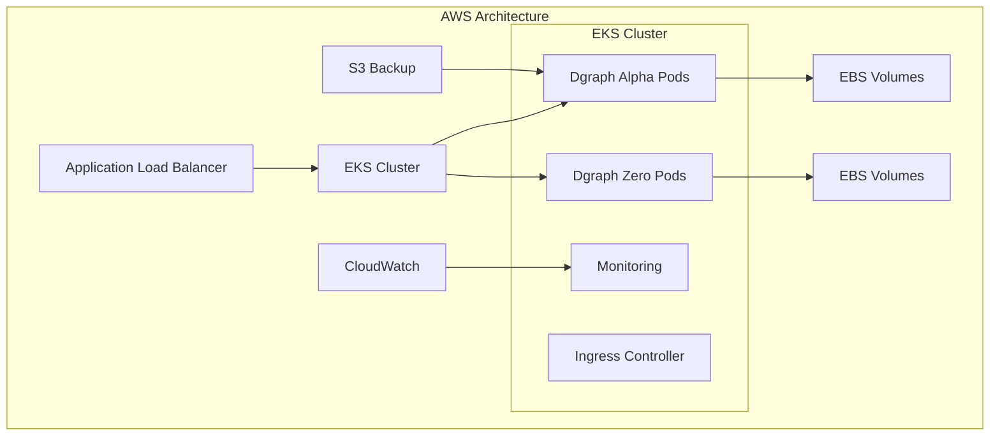

## AWS Deployment

Deploy your self-hosted Dgraph cluster on Amazon Web Services using Elastic
Kubernetes Service (EKS).

### Prerequisites
- AWS Account with appropriate permissions to create EKS clusters, IAM roles, and VPCs.
- kubectl installed and configured to interact with your EKS cluster.
- eksctl or AWS CLI for cluster management.
- Helm for deploying Dgraph.



### 1. Create an EKS Cluster

<Steps>
<Step name="Create EKS Cluster">

```bash Create EKS Cluster
aws eks create-cluster \
  --name <cluster-name> \
  --region <region> \
  --role-arn <eks-cluster-role-arn> \
  --resources-vpc-config subnetIds=<subnet-id-1>,<subnet-id-2>,<subnet-id-3>,securityGroupIds=<security-group-id>
```
Required Parameters:

- name: Name of your EKS cluster (e.g., my-eks-cluster).
- region: AWS region (e.g., us-west-2).
- role-arn: ARN of the IAM role for EKS. This role must have the AmazonEKSClusterPolicy attached.
- resources-vpc-config:

subnetIds: List of subnet IDs (at least 2 in different AZs for high availability).
securityGroupIds: Security group ID for the cluster


```bash Create Node Group
aws eks create-nodegroup \
  --cluster-name <cluster-name> \
  --region <region> \
  --nodegroup-name <nodegroup-name> \
  --subnets <subnet-id-1> <subnet-id-2> \
  --node-role <node-instance-role-arn> \
  --instance-types <instance-type> \
  --scaling-config minSize=<min-nodes>,maxSize=<max-nodes>,desiredSize=<desired-nodes>
```
Required Parameters:

- --cluster-name: Name of your EKS cluster.
- --region: AWS region.
- --nodegroup-name: Name of the node group (e.g., my-node-group).
- --subnets: Subnet IDs where the nodes will be launched.
- --node-role: ARN of the IAM role for the node group. This role must have the AmazonEKSWorkerNodePolicy, AmazonEC2ContainerRegistryReadOnly, and AmazonEC2FullAccess policies attached.
- --instance-types: EC2 instance type (e.g., t3.medium).
- --scaling-config: Minimum, maximum, and desired number of nodes.
</Step>

<Step name="update your kubectl config">

After cluster creation, update your kubectl config file (~/.kube/config) so that all kubectl commands now interact with your EKS cluster.
```bash Update Kubeconfig
aws eks update-kubeconfig --region us-west-2 --name dgraph-cluster
```
</Step>

<Step title="Apply Storage Class">

```yaml aws-storage-class.yaml
apiVersion: storage.k8s.io/v1
kind: StorageClass
metadata:
  name: dgraph-storage
provisioner: ebs.csi.aws.com
parameters:
  type: gp3
  iops: "3000"
  throughput: "125"
volumeBindingMode: WaitForFirstConsumer
allowVolumeExpansion: true
```

    ```bash kubectl apply -f aws-storage-class.yaml ```
</Step>
</Steps>

### 2. Deploy Dgraph Using Helm

<Steps>
  
<Step title="Add Helm Repository">
  ```bash
  helm repo add dgraph https://charts.dgraph.io
  helm repo update
  ```
</Step>

<Step title="Create Namespace">
  ```bash kubectl create namespace dgraph ```
</Step>

  <Step title="Deploy Dgraph">
    ```bash
    helm install dgraph dgraph/dgraph \
      --namespace dgraph \
      --set image.tag="v24.1.4" \
      --set alpha.persistence.storageClass="dgraph-storage" \
      --set alpha.persistence.size="500Gi" \
      --set zero.persistence.storageClass="dgraph-storage" \
      --set zero.persistence.size="100Gi" \
      --set alpha.replicaCount=3 \
      --set zero.replicaCount=3 \
      --set alpha.resources.requests.memory="8Gi" \
      --set alpha.resources.requests.cpu="2000m"
    ```
  </Step>
</Steps>

### 3. Load Balancer Configuration

```yaml aws-ingress.yaml
apiVersion: networking.k8s.io/v1
kind: Ingress
metadata:
  name: dgraph-ingress
  namespace: dgraph
  annotations:
    kubernetes.io/ingress.class: alb
    alb.ingress.kubernetes.io/scheme: internet-facing
    alb.ingress.kubernetes.io/target-type: ip
    alb.ingress.kubernetes.io/certificate-arn: arn:aws:acm:REGION:ACCOUNT:certificate/CERT-ID
spec:
  rules:
    - host: dgraph.yourdomain.com
      http:
        paths:
          - path: /
            pathType: Prefix
            backend:
              service:
                name: dgraph-dgraph-alpha
                port:
                  number: 8080
```

### 
```bash
kubectl get services -n dgraph
```