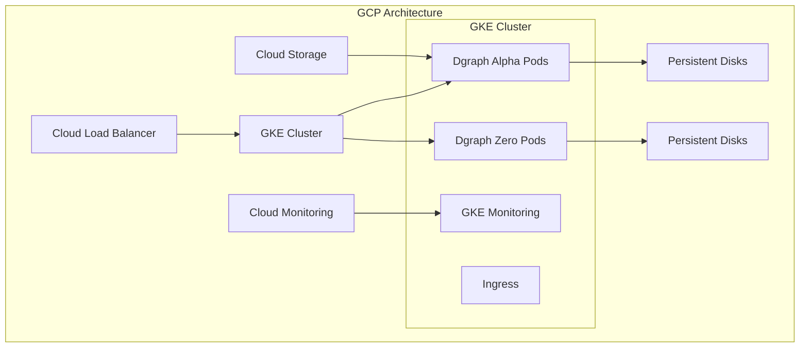

## Google Cloud Platform Deployment

Deploy your self-hosted Dgraph cluster on Google Cloud Platform using Google
Kubernetes Engine (GKE).



### 1. GKE Cluster Setup

<CodeGroup>
```bash Create GKE Cluster
gcloud container clusters create dgraph-cluster \
  --zone=us-central1-a \
  --machine-type=e2-standard-4 \
  --num-nodes=3 \
  --disk-size=100GB \
  --disk-type=pd-ssd \
  --enable-autoscaling \
  --min-nodes=3 \
  --max-nodes=9 \
  --enable-autorepair \
  --enable-autoupgrade
```

```bash Get Credentials
gcloud container clusters get-credentials dgraph-cluster --zone=us-central1-a
```

```bash Create Storage Class
kubectl apply -f - <<EOF
apiVersion: storage.k8s.io/v1
kind: StorageClass
metadata:
  name: dgraph-storage
provisioner: kubernetes.io/gce-pd
parameters:
  type: pd-ssd
  zones: us-central1-a,us-central1-b,us-central1-c
volumeBindingMode: WaitForFirstConsumer
allowVolumeExpansion: true
EOF
```

</CodeGroup>

### 2. Deploy Dgraph on GKE

```bash
# Create namespace
kubectl create namespace dgraph

# Deploy with Helm
helm install dgraph dgraph/dgraph \
  --namespace dgraph \
  --set alpha.persistence.storageClass="dgraph-storage" \
  --set zero.persistence.storageClass="dgraph-storage" \
  --set alpha.persistence.size="500Gi" \
  --set zero.persistence.size="100Gi" \
  --set alpha.replicaCount=3 \
  --set zero.replicaCount=3
```

### 3. Load Balancer Setup

```yaml gcp-ingress.yaml
apiVersion: networking.k8s.io/v1
kind: Ingress
metadata:
  name: dgraph-ingress
  namespace: dgraph
  annotations:
    kubernetes.io/ingress.global-static-ip-name: dgraph-ip
    networking.gke.io/managed-certificates: dgraph-ssl-cert
spec:
  rules:
    - host: dgraph.yourdomain.com
      http:
        paths:
          - path: /*
            pathType: ImplementationSpecific
            backend:
              service:
                name: dgraph-dgraph-alpha
                port:
                  number: 8080
```
