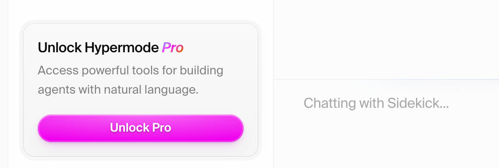

In this tutorial we'll get started with our first Hypermode Agent named
Sidekick. Sidekick is a personal assistant that can help you with your daily
tasks, such as scheduling meetings, reviewing our calendar, and preparing for
meetings by conducting research.

Along the way we'll introduce the basic concepts of working with agents in
Hypermode, including the concepts of [connections](/agents/connections),
[threads](/agents/work), and [tasks](/agents/tasks).

## Sign in to Hypermode

First, we'll [sign in to Hypermode](https://hypermode.com/login) and create our
first workspace if we haven't done that yet.

## Meet our Sidekick agent

Once we've signed in and created a workspace, we'll meet our Sidekick agent.
Sidekick is included with the Hypermode free tier and is a great way to get
started with Hypermode Agents by learning how to interact with agents and add
[connections](/agents/connections).

Connections give our agents access to external tools and services, such as
Google Calendar, email, GitHub, our CRM, and more.

## Sidekick connections

Let's configure the Google Calendar connection so Sidekick can access our
calendar and help us prepare for meetings.

<Tip>
  Sidekick is configured to connect to Google Calendar. Over 2000 other
  connections are available by upgrading to the Hypermode Pro tier.
</Tip>

## Suggestion task

Sidekick is configured with [tasks](/agents/tasks) to help us interact with our
agent. Tasks are a repeatable set of instructions that you can save and use
later with your agent. Think of a task as a learned skill for your agent.

## Chat and tools

In addition to selecting tasks, we can also interact with our agent through
natural language chat. The agent uses tools to complete our requests. By asking
the agent "who are we meeting with?" it uses the Google Calendar connection to
access our calendar and find the meeting we're preparing for.

## Prepare for meetings

Tools can be combined by the agent to complete our requests. Here we ask
Sidekick to prepare for our meetings by researching who we're scheduled to meet
with. Sidekick uses the Google Calendar connection to access our calendar and
find the meeting we're preparing for, extracts the meeting details including
other participants, then uses a built-in research tool to research the
participants.

## Generate talking points

We can ask Sidekick to generate talking points for our meeting. Sidekick uses
the results of the research tool and our specific guidance to generate talking
points.

## Update calendar invite

We can ask Sidekick to update our calendar invite with the talking points we
just generated. Sidekick uses the Google Calendar connection to update our
invite.

## Writing to other services

Sidekick is configured to connect to Google Calendar. To enable other
connections you'll need to upgrade to the
[Hypermode Pro tier](https://hypermode.com/pricing).

Explore other ways that Sidekick can help you in your daily tasks. When you're
ready to explore creating new agents with new capabilities and adding other
connections, upgrade to the Hypermode Pro tier by scheduling your onboarding
call.

Creating more custom agents from natural language, choosing over 2000 additional
connections to add to our agent, and more are features available in the
Hypermode Pro tier. Once you've completed the Pro-tier onboarding you'll be able
to create agents with custom instructions. In the mean time check out the
[Agent Gallery](/agents/example-agents) to see what kinds of agents you'll be
able to create with [Hypermode Agents Pro tier](https://hypermode.com/pricing).
