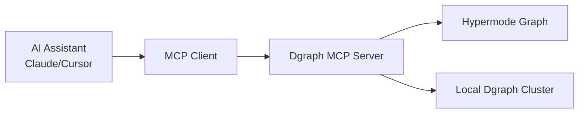
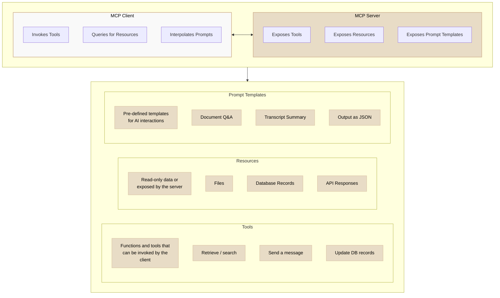

## Overview

The Hypermode Graph MCP (Model Context Protocol) server enables seamless
integration between your graph database and AI coding assistants like Claude
Desktop, Cursor, and other MCP-compatible tools. Two MCP endpoints are available
with common tools for AI coding assistants: `mcp` (a server that provides tools
and data from your Dgraph cluster) and `mcp-ro` (a server that provides tools
and data from your Dgraph cluster in read-only mode).

<Note>
  **What's MCP?** The Model Context Protocol is an open standard that enables
  developers to build secure, two-way connections between their data sources and
  AI-powered tools. Think of it as a universal connector that allows AI
  assistants to understand and interact with your graph data.
</Note>

## Why use Hypermode Graph MCP?

### For exploratory data analysis

- **Interactive graph exploration**: Query your knowledge graphs using natural
  language through your AI assistant
- **Pattern Discovery**: Let AI help identify relationships, clusters, and
  anomalies in your graph data
- **Dynamic schema understanding**: AI assistants can introspect your graph
  structure and suggest optimal queries
- **Real-time insights**: Get immediate answers about your data without writing
  complex DQL queries

### For AI coding assistants

- **Context-aware development**: Your coding assistant understands your graph
  schema and data patterns
- **Intelligent query generation**: AI can write and optimize DQL queries based
  on your specific use case
- **Schema evolution support**: Get suggestions for schema changes and
  migrations
- **Debugging assistance**: AI can help troubleshoot graph queries and
  performance issues

## Architecture

The Dgraph MCP server follows the standard MCP architecture:



**Components:**

- **MCP host**: Your AI-powered app (Claude Desktop, IDE with AI features)
- **MCP client**: Protocol client that maintains connection with the Dgraph
  server
- **Dgraph MCP server**: Exposes graph capabilities through standardized MCP
  interface
- **Graph database**: Your Dgraph cluster (local or on Hypermode)

## MCP server types

Dgraph provides two MCP server variants to match your security and usage
requirements:

### Standard MCP server (`mcp`)

- **Full Access**: Read and write operations on your graph
- **Use Cases**: Development environments, data modeling, schema evolution
- **Capabilities**: Query execution, mutations, schema modifications, namespace
  management

### Read-only MCP server (`mcp-ro`)

- **Safe Exploration**: Query-only access to your graph data
- **Use Cases**: Production analysis, reporting, exploratory data analysis
- **Capabilities**: DQL queries, schema introspection, data visualization
  support

<Warning>
  Choose the read-only server (`mcp-ro`) for production environments or when
  working with sensitive data to prevent accidental modifications.
</Warning>

## Setup guide

When using Hypermode Graphs, the MCP configuration is available on the graph
details screen in the console:

<Steps>
<Step title="Access Graph Console">
Navigate to your Hypermode workspace and select your graph instance.
</Step>

<Step title="Copy MCP Configuration">
  From the graph details screen, copy the provided MCP configuration.
</Step>

<Step title="Configure Your AI Assistant">
Add the configuration to your AI assistant's settings:

```json
{
  "mcpServers": {
    "hypermode-graph": {
      "command": "npx",
      "args": [
        "mcp-remote",
        "https://<graph-workspace>.hypermode.host/mcp/sse",
        "--header",
        "Authorization: Bearer <bearer-token>"
      ]
    }
  }
}
```

</Step>
</Steps>

## Available capabilities



### Tools

Interactive tools for graph operations:

The MCP servers provide the following tools:

#### `get_schema`

Retrieve the current schema of your graph database.

#### `run_query`

Run a DQL query on your graph database.

**Parameters:**

- `query` (string): DQL query to execute

#### `run_mutation`

Run a DQL mutation on your graph database.

**Parameters:**

- `mutation` (string): DQL mutation to execute

#### `alter_schema`

Modify the DQL schema of your graph database.

**Parameters:**

- `schema` (string): DQL schema to apply

#### `get_common_queries`

Provides reference queries to aide in query syntax.

### Resources

The MCP server exposes your graph data as accessible resources:

#### `dgraph://schema`

The current Dgraph DQL schema.

#### `dgraph://common_queries`

Pre-built query patterns for common operations.

### Prompts

Pre-configured prompt templates for common graph operations:

- **Data Exploration**: "Analyze the structure and relationships in this graph"
- **Performance Optimization**: "Suggest improvements for this query
  performance"
- **Schema Design**: "Help design an optimal schema for this data model"
- **Migration Planning**: "Plan a migration strategy for this schema change"

#### `quickstart_prompt`

A quickstart prompt for getting started with graph MCP.

## Example workflows

### Exploratory data analysis

<iframe
  src="https://www.youtube.com/embed/cKJuzAs5Www"
  title="Hypermode Graph MCP With Claude Desktop"
  frameborder="0"
  allow="accelerometer; autoplay; clipboard-write;
encrypted-media; gyroscope; picture-in-picture"
  allowfullscreen
  style={{ aspectRatio: "16 / 9", width: "100%" }}
></iframe>

<Steps>
<Step title="Understand your data">
Ask your AI assistant: "What does the graph schema look like and what are the main entity types?"
</Step>

<Step title="Discover patterns">
  "Find all users who have more than 10 connections and show their relationship
  patterns."
</Step>

<Step title="Analyze distributions">
  "What's the distribution of node types in the graph? Are there any outliers or
  interesting clusters?"
</Step>

<Step title="Performance insights">
"Which queries are running slowly and how can we optimize them?"
</Step>
</Steps>

### AI-assisted development

<Steps>
<Step title="Schema design">
"I want to model a social network with users, posts, and interactions. What's the optimal schema design?"
</Step>

<Step title="Query optimization">
  "This query is slow: `[paste query]`. How can we improve its performance?"
</Step>

<Step title="Index recommendations">
  "Based on the query patterns, what indices should we add to improve
  performance?"
</Step>

<Step title="Migration planning">
"I need to add a new 'tags' predicate to existing posts. What's the safest migration approach?"
</Step>
</Steps>

## Best practices

### Security

- **Use Read-Only Servers**: Default to `mcp-ro` for analysis and exploration
- **Authentication**: Always use bearer tokens for Hypermode connections

### Development workflow

- **Start with Read-Only**: Begin exploration with `mcp-ro` to understand your
  data
- **Iterative Schema Design**: Use AI assistance for gradual schema evolution
- **Query Testing**: Validate AI-generated queries in development before
  production
- **Documentation**: Keep schema documentation updated for better AI
  understanding

## Community and support

<CardGroup cols={3}>
<Card title="Discord Community" icon="discord" href="https://discord.gg/hypermode">
Join discussions about Graph MCP and get help from the community
</Card>

<Card
  title="GitHub Issues"
  icon="github"
  href="https://github.com/hypermodeinc/dgraph/issues"
>
  Report bugs and request features for the MCP server
</Card>

<Card title="Documentation" icon="book" href="https://docs.hypermode.com/dgraph">
Comprehensive Dgraph documentation and guides
</Card>
</CardGroup>
```
