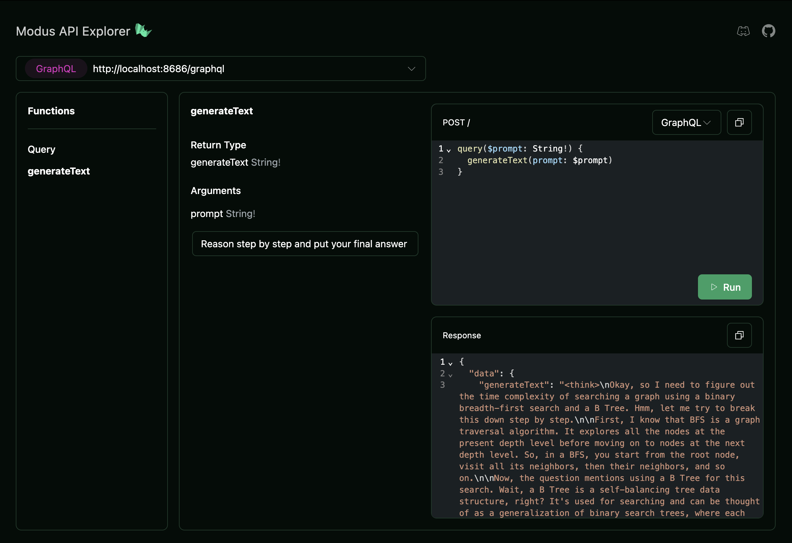
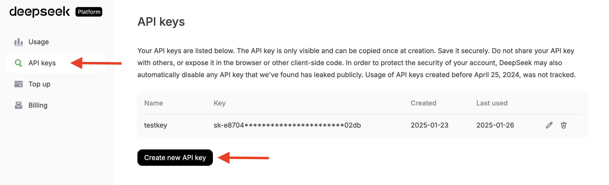
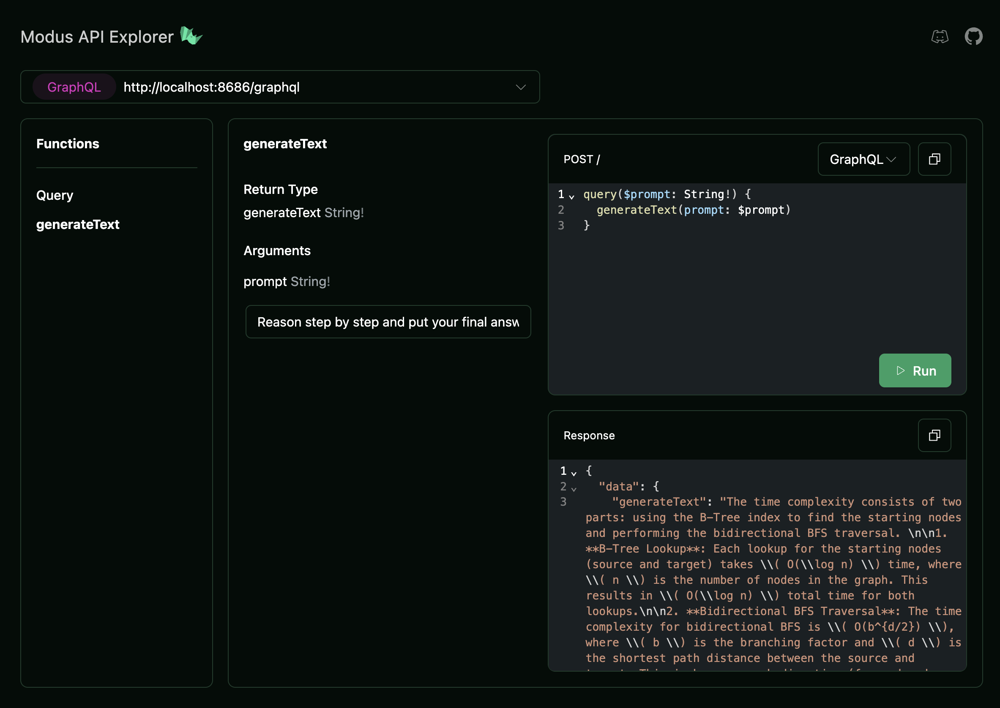

`DeepSeek-R1` is an open source AI reasoning model that rivals the performance
of frontier models such as OpenAI's o1 in complex reasoning tasks like math and
coding. Benefits of DeepSeek include:

- **Performance**: `DeepSeek-R1` achieves comparable results to OpenAI's o1
  model on several benchmarks.
- **Efficiency**: The model uses significantly fewer parameters and therefore
  operates at a lower cost relative to competing frontier models.
- **Open Source**: The open source license allows both commercial and
  non-commercial usage of the model weights and associated code.
- **Novel training approach**: The research team developed DeepSeek-R1 through a
  multi-stage approach that combines reinforcement learning, fine-tuning, and
  data distillation.
- **Distilled versions**: The DeepSeek team released smaller, distilled models
  based on DeepSeek-R1 that offer high reasoning capabilities with fewer
  parameters.

In this guide we review how to use the `DeepSeek-R1` model in your Modus app.

## Options for using DeepSeek with Modus

There are two options for using `DeepSeek-R1` in your Modus app:

1. [Use the distilled `DeepSeek-R1` model hosted by Hypermode](#using-the-distilled-deepseek-model-hosted-by-hypermode)
   Hypermode hosts and makes available the distilled DeepSeek model based on
   `Llama-3.1-8B` enabling Modus apps to use it in both local development
   environments and deployed applications.

2. [Use the DeepSeek Platform API with your Modus app](#using-the-deepseek-platform-api-with-modus)
   Access DeepSeek models hosted on the DeepSeek platform by configuring a
   DeepSeek connection in your Modus app and using your DeepSeek API key

## Using the distilled DeepSeek model hosted by Hypermode

The open source `DeepSeek-R1-Distill-Llama-8B` DeepSeek model is available on
Hypermode as a [shared model](/hosted-models#shared-models). This means that we
can invoke this model in a Modus app in both a local development environment and
also in an app deployed on Hypermode.

The `DeepSeek-R1-Distill-Llama-8B` model is a distilled version of the
DeepSeek-R1 model which has been fine-tuned using the `Llama-3.1-8B` model as a
base model, using samples generated by DeepSeek-R1.

Distilled models offer similar high reasoning capabilities with fewer
parameters.

<Steps>

<Step title="Create a Modus app">

If you haven't already, create a new modus app. Skip this step if you already
have a Modus app.

```sh
modus new
```

<Tip>
  See [the Modus Quickstart](quickstart) for more information about creating
  Modus projects.
</Tip>

</Step>

<Step title="Add the DeepSeek model to your app manifest">

Update your Modus app manifest `modus.json` file to specify the
`DeepSeek-R1-Distill-Llama-8B` model hosted on Hypermode.

```json modus.json
  "models": {
    "deepseek-reasoner": {
      "sourceModel": "deepseek-ai/DeepSeek-R1-Distill-Llama-8B",
      "provider": "hugging-face",
      "connection": "hypermode"
    }
  },
```

<Note>
  Note that we named the model `deepseek-reasoner` in our app manifest, which we
  use to access the model in our Modus function.
</Note>

</Step>

<Step title="Use the hyp CLI to sign in to Hypermode">

To use Hypermode hosted models in our local development environment we use the
`hyp` CLI to log in to Hypermode.

Install the `hyp` CLI if not previously installed.

```sh
npm i -g @hypermode/hyp-cli
```

Login to Hypermode using the command:

```sh
hyp login
```

If signing in for the first time, Hypermode prompts to create an account and
specify an organization.

</Step>

<Step title="Write a function to invoke the model">

You can now invoke the model in your Modus app's functions using the Modus
models interface.

Here we write a function that takes a prompt as input, invokes the DeepSeek
model, and returns the generated text as output. At runtime this function
becomes a GraphQL Query field in the GraphQL API generated by Modus.

<CodeGroup>

```go Go
package main

import (
   "strings"

   "github.com/hypermodeinc/modus/sdk/go/pkg/models"
   "github.com/hypermodeinc/modus/sdk/go/pkg/models/openai"
)

func GenerateText(prompt string) (string, error) {

   model, err := models.GetModel[openai.ChatModel]("deepseek-reasoner")
   if err != nil {
       return "", err
   }

   // DeepSeek recommends not using a system prompt and including all instructions in the user prompt
   input, err := model.CreateInput(
       openai.NewUserMessage(prompt),
   )
   if err != nil {
       return "", err
   }

   // DeepSeek recommends setting temperature within the range of 0.5-0.7 with 0.6 the recommended default
   input.Temperature = 0.6

   // Here we invoke the model with the input we created.
   output, err := model.Invoke(input)
   if err != nil {
       return "", err
   }

   // The output is also specific to the ChatModel interface.
   // Here we return the trimmed content of the first choice.
   return strings.TrimSpace(output.Choices[0].Message.Content), nil
}
```

```ts AssemblyScript
import { models } from "@hypermode/modus-sdk-as"

import {
  OpenAIChatModel,
  SystemMessage,
  UserMessage,
} from "@hypermode/modus-sdk-as/models/openai/chat"

export function generateText(prompt: string): string {
  const model = models.getModel<OpenAIChatModel>("deepseek-reasoner")

  // DeepSeek recommends not using a system prompt and including all instructions in the user prompt
  const input = model.createInput([new UserMessage(prompt)])

  // DeepSeek recommends setting temperature within the range of 0.5-0.7 with 0.6 the recommended default
  input.temperature = 0.6

  // Here we invoke the model with the input we created.
  const output = model.invoke(input)

  // The output is also specific to the OpenAIChatModel interface.
  // Here we return the trimmed content of the first choice.
  return output.choices[0].message.content.trim()
}
```

</CodeGroup>

<Info>
  DeepSeek recommends not using a system prompt with DeepSeek-R1 and setting the
  `temperature` parameter in the range of 0.5-0.7
</Info>

</Step>

<Step title="Run your Modus app">
Run your Modus app locally:

```sh
modus dev
```

This command compiles your Modus app and starts a local GraphQL API endpoint.

</Step>

<Step title="Query your function in the Modus API Explorer">

Open the Modus API Explorer in your web browser at
`http://localhost:8686/explorer`.

Add your prompt as an input argument for the `generateText` query field and
select "Run" to invoke the DeepSeek model.



<Tip>
  For mathematical problems,use a directive in your prompt such as: "Please
  reason step by step, and include your final answer within `\boxed{}.`"
</Tip>

</Step>

</Steps>

This example demonstrated how to use the DeepSeek-R1 Distilled Model hosted by
Hypermode in a Modus app to create an endpoint that returns text generated by
the DeepSeek model. More advanced use cases for leveraging the DeepSeek
reasoning models in your Modus app include workflows like tool use / function
calling, generating structured outputs, problem solving, code generation, and
much more. [Let us know](mailto:hello@hypermode.com?subject=DeepSeek+Modus) how
you're leveraging DeepSeek with Modus.

## Using the DeepSeek platform API with Modus

This option involves using the DeepSeek models hosted by DeepSeek Platform with
your Modus app. You'll need to create an account with DeepSeek Platform and pay
for your model usage.

<Steps>
<Step title="Create a DeepSeek API key">
Create an account with [DeepSeek Platform](https://platform.deepseek.com).

Once you've signed in select the "API keys" tab and "Create new API token" to
generate your DeepSeek Platform API token.



</Step>
<Step title="Create a Modus app">
If you haven't already, create a new modus app. Skip this step if you already have a Modus app.

```sh
modus new
```

<Tip>
  See [the Modus Quickstart](quickstart) for more information about creating
  Modus projects.
</Tip>

</Step>

<Step title="Define the model and connection in your app manifest">

Update your Modus app's `modus.json` app manifest file to include the DeepSeek
model and a connection for the DeepSeek Platform API. Use `deepseek-reasoner` as
the value for `sourceModel` for the DeepSeek-R1 reasoning model and
`deepseek-chat` for the DeepSeek-V3 model.

```json modus.json
{
  "models": {
    "deepseek-reasoner": {
      "sourceModel": "deepseek-reasoner",
      "connection": "deepseek",
      "path": "v1/chat/completions"
    }
  },
  "connections": {
    "deepseek": {
      "type": "http",
      "baseUrl": "https://api.deepseek.com/",
      "headers": {
        "Authorization": "Bearer {{API_TOKEN}}"
      }
    }
  }
}
```

<Note>
At query time, Modus replaces the `{{API_TOKEN}}`secret placeholder with your `MODUS_DEEPSEEK_API_TOKEN` environment variable value.

Set this environment variable value in the next step.

</Note>

</Step>

<Step title="Create environment variable for your API token">
Edit the `.env.dev.local` file to declare an environment variable for your DeepSeek Platform API key.

```env
MODUS_DEEPSEEK_API_TOKEN=<YOUR_TOKEN_VALUE_HERE>
```

<Note>

Modus namespaces environment variables for secrets placeholders with `MODUS` and
your connection's name from the app manifest. For more details on using secrets
in Modus, refer to
[working locally with secrets](app-manifest#working-locally-with-secrets).

</Note>

</Step>

<Step title="Write a function to invoke the DeepSeek model">

You can now invoke the model in your Modus app's functions using the Modus
models interface.

Here we write a function that takes a prompt as input, invokes the DeepSeek
model, and returns the generated text as output. At runtime this function
becomes a GraphQL Query field in the GraphQL API generated by Modus.

<CodeGroup>

```go Go
    package main

    import (
        "strings"

        "github.com/hypermodeinc/modus/sdk/go/pkg/models"
        "github.com/hypermodeinc/modus/sdk/go/pkg/models/openai"
    )

    func GenerateText(prompt string) (string, error) {

        model, err := models.GetModel[openai.ChatModel]("deepseek-reasoner")
        if err != nil {
            return "", err
        }

        // DeepSeek recommends not using a system prompt and including all instructions in the user prompt
        input, err := model.CreateInput(
            openai.NewUserMessage(prompt),
        )
        if err != nil {
            return "", err
        }

        // DeepSeek recommends setting temperature within the range of 0.5-0.7 with 0.6 the recommended default
        input.Temperature = 0.6

        // Here we invoke the model with the input we created.
        output, err := model.Invoke(input)
        if err != nil {
            return "", err
        }

        // The output is also specific to the ChatModel interface.
        // Here we return the trimmed content of the first choice.
        return strings.TrimSpace(output.Choices[0].Message.Content), nil
    }
```

```ts AssemblyScript
import { models } from "@hypermode/modus-sdk-as"

import {
  OpenAIChatModel,
  SystemMessage,
  UserMessage,
} from "@hypermode/modus-sdk-as/models/openai/chat"

export function generateText(prompt: string): string {
  const model = models.getModel<OpenAIChatModel>("deepseek-reasoner")

  // DeepSeek recommends not using a system prompt and including all instructions in the user prompt
  const input = model.createInput([new UserMessage(prompt)])

  // DeepSeek recommends setting temperature within the range of 0.5-0.7 with 0.6 the recommended default
  input.temperature = 0.6

  // Here we invoke the model with the input we created.
  const output = model.invoke(input)

  // The output is also specific to the OpenAIChatModel interface.
  // Here we return the trimmed content of the first choice.
  return output.choices[0].message.content.trim()
}
```

</CodeGroup>

<Info>
  DeepSeek recommends not using a system prompt with DeepSeek-R1 and setting the
  `temperature` parameter in the range of 0.5-0.7
</Info>

</Step>

<Step title="Run your Modus app">

Run your Modus app locally:

```sh
modus dev
```

This command compiles your Modus app and starts a local GraphQL API endpoint.

</Step>

<Step title="Query using the Modus API Explorer">
Open the Modus API Explorer in your web browser at `http://localhost:8686/explorer`.

Add your prompt as an input argument for the `generateText` query field and
select "Run" to invoke the DeepSeek model.



<Tip>
  For mathematical problems,use a directive in your prompt such as: "Please
  reason step by step, and include your final answer within `\boxed{}.`"
</Tip>

</Step>

</Steps>

This example demonstrated how to use the DeepSeek Platform API in a Modus app to
create an endpoint that returns text generated by the DeepSeek-R1 model. More
advanced use cases for leveraging the DeepSeek reasoning models in your Modus
app include workflows like tool use / function calling, generating structured
outputs, problem solving, code generation, and much more.
[Let us know](mailto:hello@hypermode.com?subject=DeepSeek+Modus) how you're
leveraging DeepSeek with Modus.

## Resources

- [DeepSeek on Hugging Face](https://huggingface.co/deepseek-ai)
- [`DeepSeek-R1-Distill-Llama-8B` model card](https://huggingface.co/deepseek-ai/DeepSeek-R1-Distill-Llama-8B)
- [DeepSeek-R1 paper](https://github.com/deepseek-ai/DeepSeek-R1/blob/main/DeepSeek_R1.pdf)
- [DeepSeek Platform API docs](https://api-docs.deepseek.com/)
