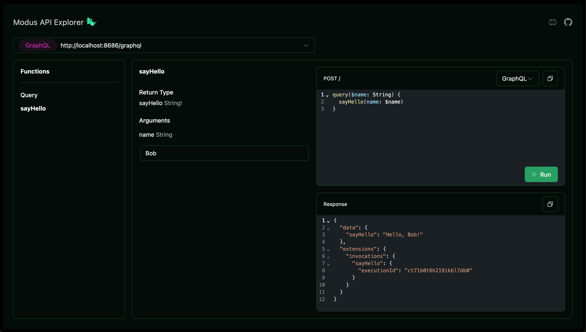

In this quickstart we'll show you how to get set up with Modus and its CLI and
build a simple app that fetches a random quote from an external API. You'll
learn how to use the basic components of a Modus app and how to run it locally.

## Prerequisites

- [Node.js](https://nodejs.org/en/download/package-manager) - v22 or higher
- Text editor - we recommend [VS Code](https://code.visualstudio.com/)
- Terminal - access Modus through a command-line interface (CLI)

## Building your first Modus app

<Steps>
  <Step title="Install the Modus CLI">
    The Modus CLI provides a set of commands to help you create, build, and run your Modus apps.
    Install the CLI using npm.

    ```bash
    npm install -g @hypermode/modus-cli
    ```

  </Step>

  <Step title="Initialize your Modus app">
    To create a new Modus app, run the following command in your terminal:

    ```bash
    modus new
    ```

    This command prompts you to choose between Go and AssemblyScript as the language for your app. It
    then creates a new directory with the necessary files and folders for your app. You will also be asked if you would like to initialize a Git repository.

  </Step>
  <Step title="Build and run your app">
    To build and run your app, navigate to the app directory and run the following command:

    ```bash
    modus dev
    ```

    This command runs your app locally in development mode and provides you with a URL to access your
    app's generated API.

  </Step>
  <Step title="Access your local endpoint">
    Once your app is running, you can access the graphical interface for your API at the URL located in your terminal.

    ```bash
    View endpoint: http://localhost:8686/explorer
    ```

    This interface allows you to interact with your app's API and test your functions.

     

  </Step>
  <Step title="Add a connection">
    Modus is a secure-by-default framework. To connect to external services, you need to add a connection
    in your app manifest.

    Add the following code into your `modus.json` manifest file:

    ```json modus.json
    {
      "connections": {
        "zenquotes": {
          "type": "http",
          "baseUrl": "https://zenquotes.io/"
        }
      }
    }
    ```

  </Step>
  <Step title="Add a function">
    Functions are the building blocks of your app. Let's add a function that fetches a random quote from
    the ZenQuotes connection you just created.

    <Tabs>
      <Tab title="Go">
        To add a function, create a new file in the root directory with the following code:

        ```go quotes.go
        package main

        import (
          "errors"
          "fmt"

          "github.com/hypermodeinc/modus/sdk/go/pkg/http"
        )

        type Quote struct {
          Quote  string `json:"q"`
          Author string `json:"a"`
        }

        // this function makes a request to an API that returns data in JSON format, and
        // returns an object representing the data
        func GetRandomQuote() (*Quote, error) {
          request := http.NewRequest("https://zenquotes.io/api/random")

          response, err := http.Fetch(request)
          if err != nil {
            return nil, err
          }
          if !response.Ok() {
            return nil, fmt.Errorf("Failed to fetch quote. Received: %d %s", response.Status, response.StatusText)
          }

          // the API returns an array of quotes, but we only want the first one
          var quotes []Quote
          response.JSON(&quotes)
          if len(quotes) == 0 {
            return nil, errors.New("expected at least one quote in the response, but none were found")
          }
          return &quotes[0], nil
        }
        ```
      </Tab>

      <Tab title="AssemblyScript">
        To add a function, create a new file in the `assembly` directory with the following code:

        ```ts quotes.ts
        import { http } from "@hypermode/modus-sdk-as";

        @json
        class Quote {
          @alias("q")
          quote!: string;

          @alias("a")
          author!: string;
        }

        // this function makes a request to an API that returns data in JSON format, and
        // returns an object representing the data
        export function getRandomQuote(): Quote {
          const request = new http.Request("https://zenquotes.io/api/random");

          const response = http.fetch(request);
          if (!response.ok) {
            throw new Error(
              `Failed to fetch quote. Received: ${response.status} ${response.statusText}`,
            );
          }

          // the API returns an array of quotes, but we only want the first one
          return response.json<Quote[]>()[0];
        }
        ```

        Then add the following to `index.ts`. This includes the `getRandomQuote` function on
        your generated API.

        ```ts index.ts
        export * from "./quotes";
        ```

      </Tab>
    </Tabs>

  </Step>
</Steps>
