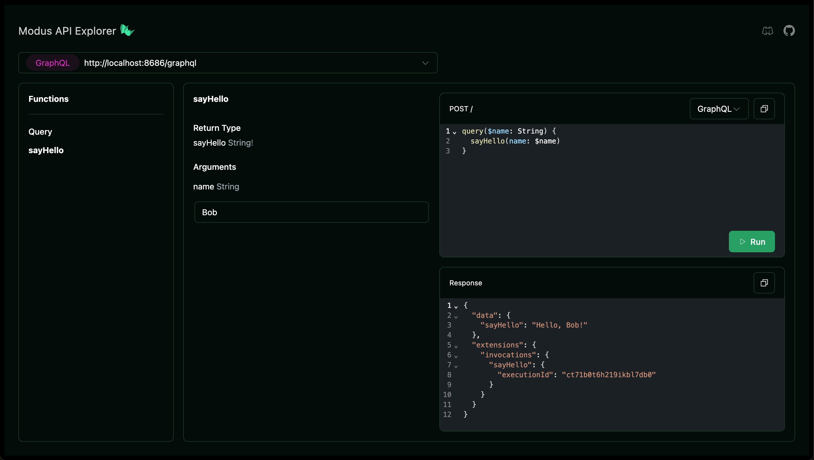

Modus provides a local development environment that makes it easy to build and
test your app, with local access to models.

## Launching your app in development mode

To run your app, from the project root, run:

```sh
modus dev
```

The `modus dev` command compiles your app code, starts a local server, and
provides a URL to access your app's API. It also enables fast refresh, which
automatically recompiles and reloads any changed functions while preserving app
state during development.

Once your app is running, you can access the graphical interface for your API at
the URL located in your terminal.

```sh
View endpoint: http://localhost:8686/explorer
```

The API Explorer interface allows you to interact with your app's API and test
your functions.



## Environment secrets

When you run your app locally using `modus dev`, the runtime replaces the
placeholders of the manifest with values from environment variables defined in
your operating system or in `.env` files.

The environment variables keys must be upper case and follow the naming
convention:

`MODUS_<CONNECTION NAME>_<PLACEHOLDER>`

For example, with the following manifest:

```json modus.json
{
  "connections": {
    "openai": {
      "type": "http",
      "baseUrl": "https://api.openai.com/",
      "headers": {
        "Authorization": "Bearer {{API_KEY}}"
      }
    }
  }
}
```

The Modus runtime substitutes `{{API_KEY}}` with the value of the environment
variable `MODUS_OPENAI_API_KEY`

An easy way to define the environment variables when working locally is to use
the file `.env.dev.local` located in your app folder.

For the previous manifest, we can set the key in the .env.dev.local file as
follow:

```text .env.dev.local
MODUS_OPENAI_API_KEY="your openai key"
```

<Warning>
  You should exclude `.env` files from source control. Projects created with
  `modus new` exclude these files automatically when creating your project.
</Warning>

## Using Hypermode-hosted models

To use Hypermode-hosted models in your local environment, first install the Hyp
CLI:

```sh
npm install -g @hypermode/hyp-cli
```

Then log in to your Hypermode account:

```sh
hyp login
```

After logging in, your app automatically connects to Hypermode-hosted models
when running locally. For more information on the models available to use, see
[hosted shared models](/hosted-models#shared-models).

## Working with Collections

Collections requires a PostgreSQL instance for local development. While
Hypermode manages this database in production, you'll need to set up PostgreSQL
locally when developing outside the Hypermode platform. For detailed setup
instructions, see
[Develop locally with Collections](/modus/search#develop-locally-with-collections).
