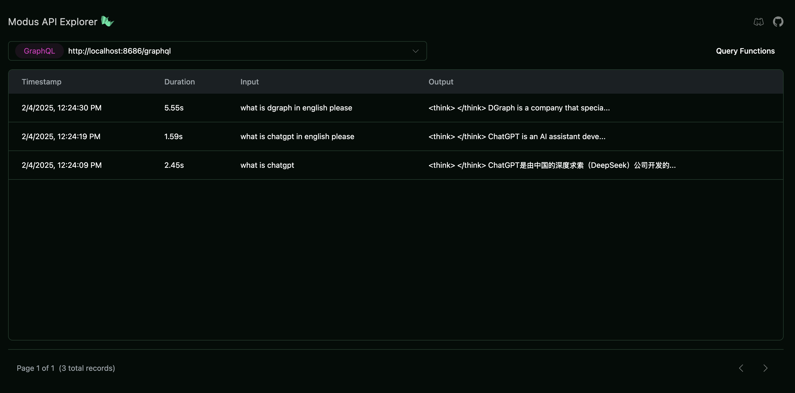

When you invoke a function or model within your app, Modus records the
execution. The Hypermode Console makes debugging simple with easy to understand
logs and metrics.

## Function runs

From your project, navigate to the Function Runs tab to view execution logs of
your functions.

For more information on recording info, warnings, and errors in your Modus app,
see [Error Handling](/modus/error-handling).

## Model tracing

For each model invocation, Hypermode records the model inference and related
metadata. This includes the input and output of the model, as well as the
timestamp and duration of the inference.

From your project, select the Inferences tab to view the inferences from your
app's models.

### Local model tracing

When testing an AI app locally, Modus records the inference and related metadata
in the `View Inferences` tab of the APIs explorer.

The local model tracing stores inferences in the `/.modusdb` directory of your
modus project. To delete inferences for cleanup, run `rm -rf .modusdb/` from the
root of the project directory.

